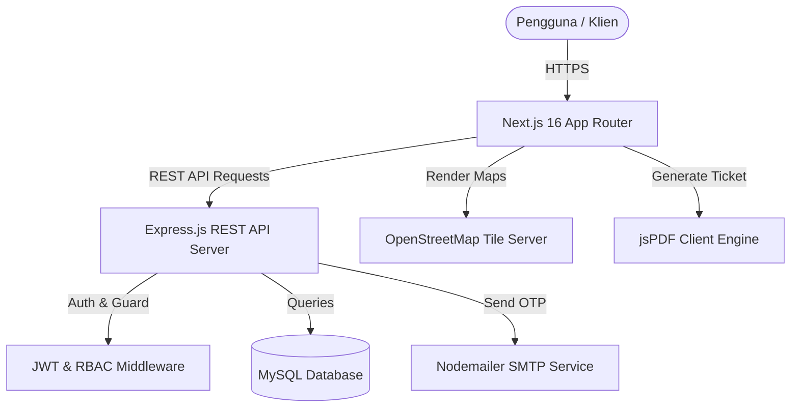

<div align="center">
  
  # 🍱 FoodBridge - Urban Food Waste Rescue Platform
  ### Penyelamatan Pangan Berlebih Berkelanjutan Menuju Kota Nol Sampah Pangan (SDG 11)
  
  [](https://api.felixt.my.id)
  [](http://localhost:3000)
  [](https://sdgs.un.org/goals/goal11)
  [](LICENSE)
  
  **Submission for ITECHNO CUP 2026 - Web Development Competition**
  
  **By Tim Bebass**
  
</div>

---

## 📋 Daftar Isi

- [Tentang Proyek](#-tentang-proyek)
- [Fitur Unggulan](#-fitur-unggulan)
- [Demo & Screenshot](#-demo--screenshot)
- [Teknologi](#-teknologi)
- [Arsitektur Sistem](#-arsitektur-sistem)
- [Instalasi & Setup](#-instalasi--setup)
- [Penggunaan](#-penggunaan)
- [API Documentation](#-api-documentation)
- [Testing & Akun Demo](#-testing--akun-demo)
- [Tim Developer](#-tim-developer)
- [Lisensi](#-lisensi)

---

## 👥 Tim Developer

| Nama | Peran | GitHub |
|---|---|---|
| **Felix Timotius** | Project Lead & Full Stack Developer | [GitHub](https://github.com/FelixTimotius) |
| **Tim Pengembang ITechnoCup** | Frontend & UI/UX Specialist | [GitHub](https://github.com) |
| **Tim Backend & Data** | Backend & Database Architect | [GitHub](https://github.com) |

---

## 🎯 Tentang Proyek

### Latar Belakang

Berdasarkan data *Food and Agriculture Organization (FAO)* dan Bappenas, Indonesia menghasilkan lebih dari **23–48 juta ton sampah makanan per tahun**, dengan kerugian ekonomi mencapai ratusan triliun rupiah. Di sisi lain, ribuan panti asuhan, komunitas dhuafa, dan keluarga prasejahtera di kawasan perkotaan masih menghadapi kerentanan pangan.

Sampah makanan organik yang menumpuk di tempat pemrosesan akhir (TPA) terurai menghasilkan gas metana ($CH_4$) yang mempercepat pemanasan global. Hal ini bertentangan dengan target **SDG 11 (Sustainable Cities and Communities)** yang menuntut kota-kota agar inklusif, aman, berketahanan, dan berkelanjutan.

### Solusi yang Ditawarkan

**FoodBridge** hadir sebagai platform *circular economy* yang menghubungkan UMKM, restoran, katering, dan supermarket yang memiliki makanan berlebih layak konsumsi (*surplus food*) dengan yayasan sosial, panti asuhan, dan komunitas masyarakat yang membutuhkan secara *real-time*, aman, dan transparan.

### Tujuan Proyek

- 🎯 **Tujuan Utama**: Menekan pemborosan makanan perkotaan (*zero food waste*) dan menjembatani redistribusi makanan layak santap ke masyarakat prasejahtera.
- 📊 **Target Pengguna**: 
  1. **Donatur (UMKM / Bisnis Kuliner)**: Restoran, kafe, warung makan, bakery, katering, hotel.
  2. **Penerima Manfaat**: Panti asuhan, panti jompo, yayasan sosial, relawan dapur umum, keluarga prasejahtera.
  3. **Administrator**: Pengawas verifikasi KYC, moderator listing makanan, dan pengelola analitik dampak lingkungan.
- 💡 **Value Proposition**:
  - Peta interaktif berbasis geolokasi (*Leaflet / OpenStreetMap*) untuk penjemputan terdekat.
  - Verifikasi OTP email untuk autentikasi terpercaya.
  - Kalkulator jejak karbon otomatis (kg $CO_2e$ yang dicegah).
  - Vokasi voucher klaim instan berformat PDF (*jsPDF*).
  - Skema crowdfunding donasi dana operasional logistik makanan.

---

## ✨ Fitur Unggulan

### Fitur Utama

| Fitur | Deskripsi | Keunggulan |
|---|---|---|
| 🍱 **Penyelamatan Pangan Real-Time** | Donatur dapat memposting donasi makanan berlebih lengkap dengan porsi, foto, alamat, dan batas waktu pengambilan. | Menghindari makanan terbuang sia-sia dengan sistem kuota porsi terintegrasi otomatis. |
| 🗺️ **Peta Sebaran Interaktif (GIS)** | Peta OpenStreetMap interaktif untuk memvisualisasikan donasi makanan terdekat dari lokasi pengguna. | Penerima manfaat dapat langsung menentukan rute dan jarak tempuh pengambilan makanan. |
| 🛡️ **Role-Based Access Control (RBAC)** | Sistem peran terpisah (*Admin*, *Donor*, *Receiver*) dengan auto-detect role saat login. | Keamanan data terjamin; alur verifikasi KYC profil UMKM dan Yayasan terkontrol oleh Admin. |
| 📄 **E-Voucher Tiket Klaim PDF** | Penerima mendapatkan e-ticket berformat PDF resmi lengkap dengan ID Klaim, barcode simulasi, dan detail narahubung. | Bukti valid saat penjemputan fisik makanan di lokasi donatur/warung. |
| 💳 **Donasi Dana Crowdfunding** | Skema penggalangan dana terintegrasi untuk mendukung wadah makanan ramah lingkungan (*bio-degradable*) dan logistik relawan. | Transparansi pelaporan donasi dana publik dengan progress bar real-time. |

### Fitur Tambahan

- **Kalkulator Dampak SDG 11**: Menghitung akumulasi porsi yang terselamatkan dan reduksi emisi gas metana/CO2e.
- **Verifikasi OTP Nodemailer**: Registrasi akun aman dengan verifikasi kode OTP 6-digit ke email pengguna.
- **Responsive Split-Screen Auth UI**: Antarmuka masuk dan daftar modern dengan palet warna ramah lingkungan (*Forest Green `#2D5A27`* & *Cream `#FAFAF9`*).
- **Admin Management Hub**: Panel khusus admin untuk memverifikasi profil donatur/penerima (KYC) serta mengelola akun pengguna.

---

## 📸 Demo & Screenshot

### Live Demo & API

- 🌐 **Backend API**: [https://api.felixt.my.id](https://api.felixt.my.id)
- 💻 **Frontend Localhost**: `http://localhost:3000`

### Screenshot Aplikasi

<div align="center">
  <p><em>Landing Page - Hero Section & Edukasi SDG 11</em></p>
  
  <p><em>Jelajah Pangan - Katalog Makanan & Peta OpenStreetMap</em></p>
  
  <p><em>Dashboard - Panel Kontrol Admin, Donatur, dan Penerima</em></p>
  
  <p><em>Split-Screen Auth - Halaman Masuk & Pendaftaran Akun</em></p>
</div>

---

## 🛠️ Teknologi

### Tech Stack

#### Frontend
```
Framework    : Next.js 16.3 (App Router with Turbopack)
Library      : React 19
Styling      : Tailwind CSS v4, Vanilla CSS Custom Variables
Icons        : React Icons (FontAwesome 5 & 6)
Mapping      : Leaflet.js & OpenStreetMap
PDF Export   : jsPDF
Language     : TypeScript
```

#### Backend
```
Runtime      : Node.js
Framework    : Express.js
Database     : MySQL / MariaDB (mysql2/promise)
Authentication : JSON Web Token (JWT) & bcrypt
Mailer       : Nodemailer (OTP Verification)
Security     : CORS, Prepared Statements, RBAC Middleware
```

#### DevOps & Tools
```
API Hosting  : Custom Linux Server (api.felixt.my.id)
Database     : Cloud MySQL with foreign key constraints & auto timestamps
Testing      : Manual QA, Postman API Testing
Version Ctrl : Git & GitHub
```

### Alasan Pemilihan Teknologi

| Teknologi | Alasan Pemilihan |
|---|---|
| **Next.js 16 & React 19** | Rendering cepat berbasis App Router, arsitektur modular, SSR & Client component yang optimal. |
| **Tailwind CSS v4** | Kemudahan styling cepat dengan konsistensi token warna alam (*Eco Forest Green*), layout responsif di semua resolusi. |
| **MySQL + RBAC Junction** | Menjamin integritas relasional data antara pengguna, peran, profil donatur/penerima, dan transaksi klaim makanan. |
| **Leaflet / OpenStreetMap** | Solusi pemetaan terbuka (*open-source*) yang ringan, akurat, dan bebas biaya lisensi API. |

---

## 🏗️ Arsitektur Sistem

### System Architecture



### Database Schema (ERD Ringkas)

```
[users] (id, public_id, name, email, password, phone, is_verified)
   │
   ├──< [user_roles] >── [roles] (id, public_id, name: admin, donor, receiver)
   ├──< [otps] (id, public_id, user_id, otp_code, expires_at, is_used)
   ├──< [donors] (id, public_id, user_id, business_name, address, is_verified)
   │       └──< [food_items] (id, public_id, donor_id, title, portions, status)
   │       └──< [money_donations] (id, public_id, donor_id, title, amount, status)
   └──< [receivers] (id, public_id, user_id, receiver_type, address, is_verified)
           └──< [donation_requests] (id, public_id, food_item_id, receiver_id, portions, status)
```

### Folder Structure

```
lomba-itechnocup-front-end/
├── back-end/                     # REST API Backend Service
│   ├── databases/
│   │   ├── mysql.js              # Database connection pool
│   │   ├── migrate.js            # Migration script
│   │   └── schema.sql            # Table definitions & initial seed data
│   ├── routes/                   # Express route handlers
│   ├── utils/
│   │   └── mailer.js             # Nodemailer OTP sender
│   ├── app.js                    # Server entrypoint
│   └── API_DOCUMENTATION.md      # Full REST API specification
│
├── front-end/                    # Next.js 16 Client Application
│   ├── app/
│   │   ├── (auth)/               # Login, Register, Verify-OTP screens
│   │   ├── (pages)/
│   │   │   ├── dashboard/        # Role-based dashboard (Admin/Donor/Receiver)
│   │   │   ├── jelajah/          # Food catalog & Leaflet GIS map
│   │   │   ├── donasi/
│   │   │   │   ├── tambah/       # Post food donation form
│   │   │   │   ├── konfirmasi/   # Claim portion confirmation
│   │   │   │   ├── klaim/        # PDF Voucher Ticket viewer
│   │   │   │   └── uang/         # Crowdfunding donation page
│   │   │   └── profil/           # User profile & badge achievements
│   │   ├── layout.tsx            # Global app layout
│   │   └── page.tsx              # Landing Page
│   ├── components/               # Header, AuthGuard, FoodCard, Map, etc.
│   └── utils/
│       ├── api.ts                # Universal API Client with fallbacks
│       └── types.ts              # TypeScript interface declarations
│
└── README.md                     # Dokumentasi Proyek
```

---

## ⚙️ Instalasi & Setup

### Prerequisites

Pastikan di komputer Anda telah terpasang:
- **Node.js** (v18.x atau lebih baru)
- **npm** (v9.x atau lebih baru)
- **MySQL / MariaDB** (v8.0+)
- **Git**

---

### Langkah Instalasi

#### 1️⃣ Clone Repository

```bash
git clone https://github.com/FelixTimotius/lomba-itechnocup-front-end.git
cd lomba-itechnocup-front-end
```

#### 2️⃣ Setup Backend

```bash
cd back-end
npm install
```

Buat file `.env` di dalam folder `back-end`:
```env
DB_HOST=localhost
DB_USER=root
DB_PASSWORD=
DB_NAME=project_lomba_sdg11
DB_PORT=3306
API_PORT=8000
JWT_SECRET=super_secret_sdg11_key
EMAIL_USER=your_email@gmail.com
EMAIL_PASS=your_app_password
```

Jalankan migrasi database dan seed awal:
```bash
node databases/migrate.js
npm start
```

#### 3️⃣ Setup Frontend

Buka terminal baru:
```bash
cd front-end
npm install
```

Buat file `.env.local` di dalam folder `front-end`:
```env
NEXT_PUBLIC_API_BASE_URL=https://api.felixt.my.id
```

Jalankan development server:
```bash
npm run dev
```

Aplikasi frontend akan aktif di: **`http://localhost:3000`**

---

## 🚀 Penggunaan

### Akun Demo untuk Pengujian

| Role | Email | Password | Akses & Wewenang |
|---|---|---|---|
| **Admin** | `admin@gmail.com` | `admin123` | Akses penuh dashboard, verifikasi KYC donatur/penerima, approve klaim, kelola seluruh data. |
| **Donatur** | `donatur@foodbridge.test` | `admin123` | Posting donasi makanan baru, kelola status permohonan masuk, rekap porsi terselamatkan. |
| **Penerima** | `penerima@foodbridge.test` | `admin123` | Menjelajah makanan di peta, mengajukan klaim porsi, mengunduh tiket voucher PDF. |

---

## 📚 API Documentation

Endpoint terhubung langsung ke live server di `https://api.felixt.my.id`.

### Ringkasan Endpoint Utama

#### 🔐 Authentication & OTP
- `POST /auth/register` : Registrasi akun baru (Kirim OTP ke email)
- `POST /auth/verify-otp` : Verifikasi 6-digit kode OTP
- `POST /auth/resend-otp` : Kirim ulang kode OTP
- `POST /auth/login` : Autentikasi user & penerbitan Bearer Token JWT
- `POST /auth/logout` : Menghapus sesi autentikasi

#### 🍱 Donasi Makanan
- `GET /donations/food` : Mengambil daftar makanan publik (bisa filter `status`, `food_type`, `search`)
- `GET /donations/food/:id` : Detail spesifik donasi makanan
- `POST /donations/food` : Menambah postingan makanan baru (*Donor & Admin*)
- `PUT /donations/food/:id` : Memperbarui data donasi makanan
- `DELETE /donations/food/:id` : Menghapus donasi makanan

#### 📥 Permintaan Klaim Porsi
- `GET /donation-requests` : Daftar permohonan klaim makanan
- `POST /donation-requests` : Mengajukan klaim porsi makanan (*Receiver*)
- `PUT /donation-requests/:id/status` : Menyetujui (`confirmed`) atau menolak (`rejected`) klaim (*Donor & Admin*)

#### 🏢 Verifikasi & Profil (Admin & KYC)
- `GET /donors` & `PUT /donors/:id/verify` : Verifikasi profil Donatur
- `GET /receivers` & `PUT /receivers/:id/verify` : Verifikasi profil Penerima
- `GET /users` : Manajemen data pengguna

📖 **Dokumentasi Lengkap API**: Lihat [back-end/API_DOCUMENTATION.md](./back-end/API_DOCUMENTATION.md)

---

## 🧪 Testing & Verifikasi

```bash
# Uji coba build production Next.js
cd front-end
npm run build

# Menjalankan build production
npm run start
```

---

## 📄 Lisensi

Proyek ini dilisensikan di bawah [MIT License](LICENSE).

---

<div align="center">

  **Made with 💚 for Sustainable Urban Living (SDG 11)**  
  **ITECHNO CUP 2026**

</div>
